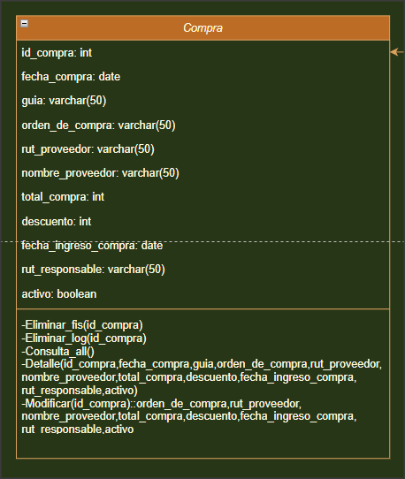
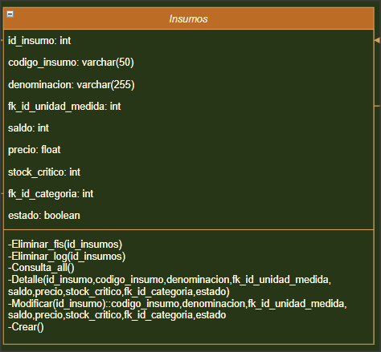
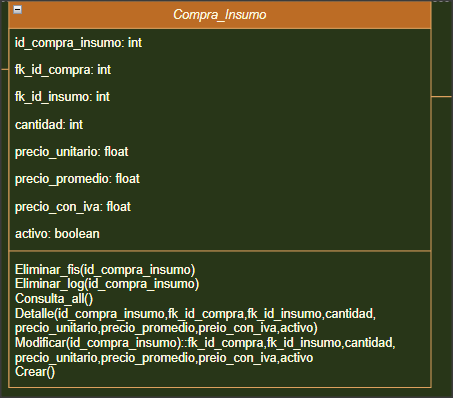
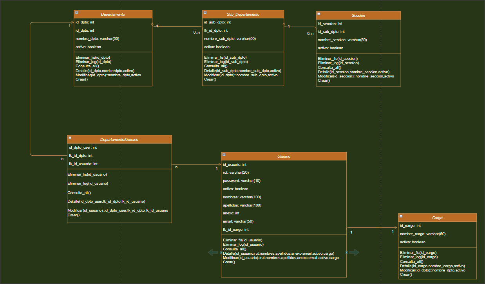
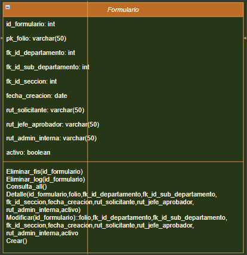
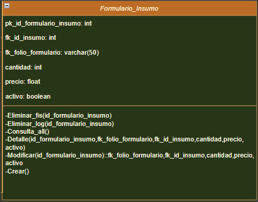
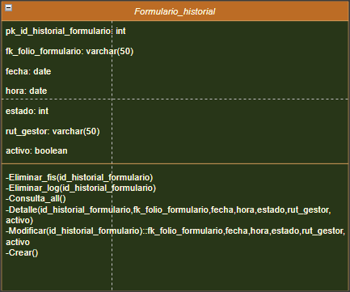
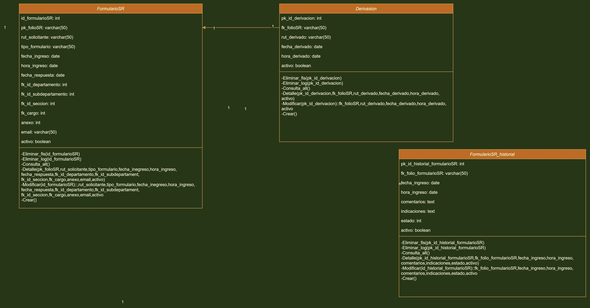

# Documentacion Plataforma de Administracion Interna (PAI)

## Modelo de Clases
***

### **1. clase compra**
Esta clase se establece para recibir todos los insumos proveniente de los proveedores a quienes les compramos, incluyendo el total de la compra ,fecha de compra e ingreso, rut y nombre del proveedor, numero de guia, orden de compra etc.

***

### **2. clase insumo**
En esta clase se ingresan los insumos denominacion es el nombre del item ingresado , unidad de medida, stock, precio etc.

***

### **3. clase compra_insumo**
Esta clase se conecta a compras e insumos de forma 1-n, y ademas se le agregan valores precio unitario, cantidad, precio promedio, precio con iva etc.

***

### **4. clase usuario_dptos_cargo**
Un usuario puede tener un solo cargo y un usuario puede terner pertener a muchos departamento, y 1 departamento puede tener muchos usuarios, un departamento puede tener cero o muchos sub-departamentos y un sub_departamento puede tener cero o muchas seciones

***

### **5. clase formulario**
Esta tabla es para solicitar **bienes o servicios** desde un catalogo

***

### **6. clase formulario_insumo**
Esta tabla es el resultado de muchos a muchos entre formulario e insumo agregandole los atributos de cantidad, precio, activo etc.

***

### **7. clase formulario_historial**
Esta clase se desprende de la clase formulario para llevar el control de las solicitudes de los BIENES y SERVICIOS quien sera asignado a llevar a cabo dicha solicitud y el estado 'pendiente,entregado,rechazado'

***

### **8. clase formularioSR_Derivacion_FormularioSR_Historial**
Estas clases formularioSR indica el departamento, sub_departamento, y seccion al cual pertenece el usuario que solicita o reclamo, ademas a quien se deriva para que resuelva dicho solicitud o reclamo y tambien se asocia el diagrama formularioSR_historial donde queda registrado la fecha y hora de la solicitud o reclamo, ademas del estado pendiente,rechazado,aprobado o realizado

***

### **9. clase formularioSR_Derivacion_FormularioSR_Historial**
Estas clases formularioSR indica el departamento, sub_departamento, y seccion al cual pertenece el usuario que solicita o reclamo, ademas a quien se deriva para que resuelva dicho solicitud o reclamo y tambien se asocia el diagrama formularioSR_historial donde queda registrado la fecha y hora de la solicitud o reclamo, ademas del estado pendiente,rechazado,aprobado o realizado

***

### **10. clase formularioSR_Derivacion_FormularioSR_Historial**
Estas clases presupuestos indica cuanto es el presupuesto que consumen de un total por dpto. sub-dpto y secciones 

